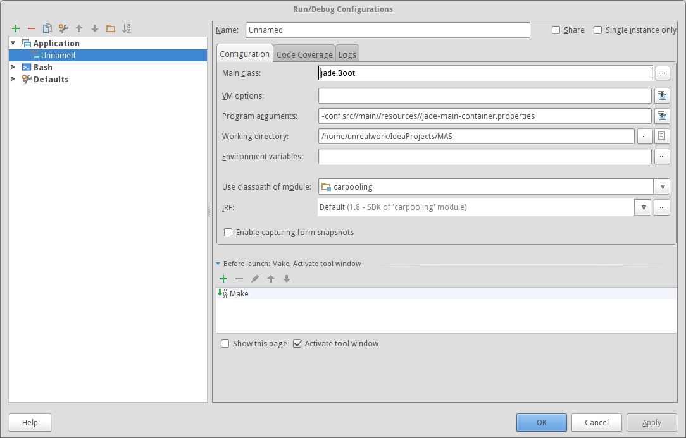

# Car Pooling Project
### Description
This project solve CarPooling task usings agent-oriented approach.

### Libraries
We use JADE framework to emulate agent interaction.


### Run command
You can run this project with following command:
```sh
mvn -Pjade-main clean compiler:compile resources:resources exec:java
```
### Intellij IDEA
If you use Intellij IDEA you can create configuration like to configuration on screenshot to run project:

